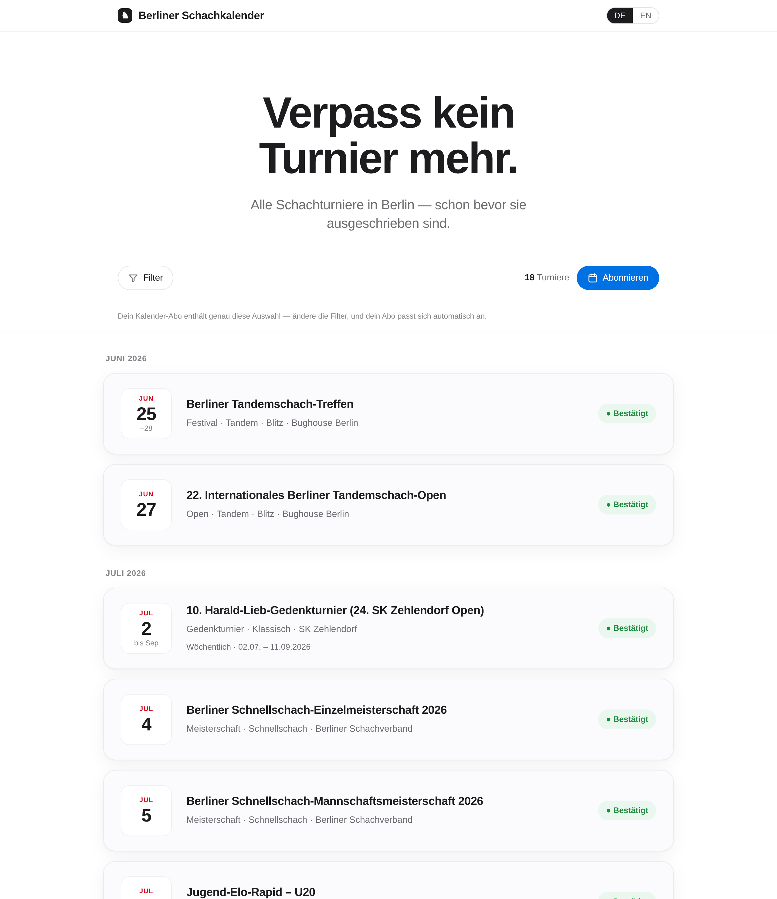
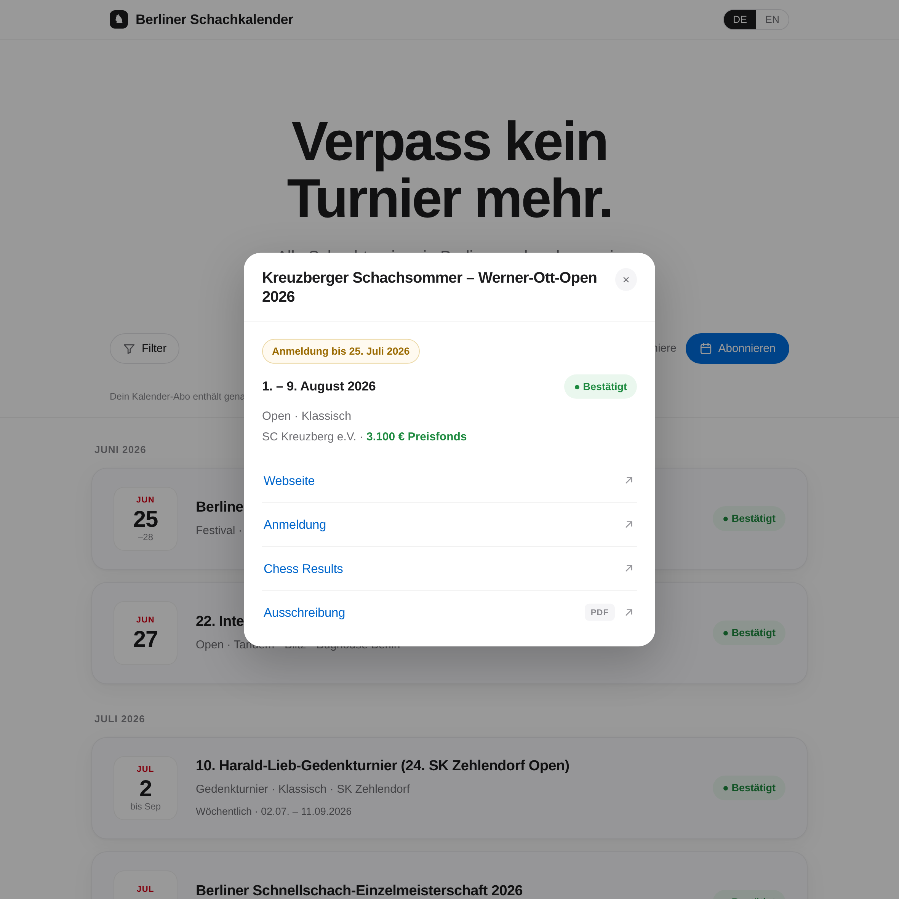

# ♞ Berliner Schachkalender

[](https://github.com/theRealProHacker/berlin-chess-calendar/actions/workflows/deploy.yml)
[](https://therealprohacker.github.io/berlin-chess-calendar/)
[](LICENSE)


A **predictive, calendar-native** chess-tournament calendar for Berlin. It lists every
over-the-board tournament in the city and — because tournaments recur every year — shows
them as *expected* **before they are officially announced**, then promotes them to
*confirmed* once the announcement lands. Filter across six axes and subscribe to an `.ics`
feed that mirrors exactly the filter you set.

German-first with an English toggle. Open data, open source, free static hosting.
**Standard library only — no dependencies, no virtualenv, no server.**

### → [**Open the calendar**](https://therealprohacker.github.io/berlin-chess-calendar/) &nbsp;·&nbsp; [Subscribe (.ics)](https://therealprohacker.github.io/berlin-chess-calendar/calendar.ics)



---

## Why it's different

- **Predictive.** Most calendars only show what's already been announced. This one forecasts
  recurring tournaments from their history (`status: expected`, marked `[erwartet]`), so you
  can plan months ahead — then they flip to `confirmed` with real dates when announced.
- **Calendar-native.** The whole point is the subscription. Hit **Abonnieren** and the
  `.ics` you get back contains *exactly the tournaments your active filters show*. Change the
  filters, your subscription changes with it — the URL carries the query.
- **Honest about provenance.** Every record cites its `sources` and `last_verified` date, and
  auto-guessed fields are flagged `tagged_by: auto` for a human to confirm.
- **Tiny and durable.** Five small stdlib modules, a single HTML template, and a JSON file.
  No framework to rot, nothing to keep patched.

## Event details & links

Click any tournament to open its detail sheet. Each event carries up to four links —
**Webseite**, **Anmeldung**, **Chess Results**, and the **Ausschreibung** (PDF) — plus the
registration deadline. *Anmeldung* is free-form: a sign-up URL when there is one, or a phrase
like *„über den Verein"* / *„über Qualifikation"* for non-opens. All four links also travel
into each `.ics` event (in the description, with the PDF as an `ATTACH`).



## How it works

```
data/tournaments.json ──► bcc.build ──► dist/index.html  (static site, data inlined)
   (validated dicts)         │     └──► dist/calendar.ics (RFC 5545 feed)
                             │
                    validate() gates every record — a bad record stops the build,
                    so the published files are always clean.
```

Deployment **is** the freshness mechanism. `.github/workflows/deploy.yml` runs the test
suite, rebuilds, and publishes `dist/` to GitHub Pages on every push to `main`. Updating the
data and pushing is all it takes to ship — `dist/` itself is never committed (it's
reproducible and git-ignored).

## Data model

One tournament is a plain validated `dict` in `data/tournaments.json` (no ORM, no schema
library). `validate()` in [`bcc/build.py`](bcc/build.py) is the single gate.

**Required:** `id` · `name` · `kind` · `start_date` · `end_date` · `variant` ·
`time_control` · `age_limit` · `participation` · `schedule_format` · `region` · `status` ·
`sources` · `last_verified`

**Optional:** `name_en` · `edition` · `rounds` · `organizer` · `venue` · `city` ·
`prize_pool` · `tagged_by` · `notes` · and the link/registration fields:

| field | meaning |
|------|---------|
| `source_url` | the event's webpage (**Webseite**) |
| `registration` | **Anmeldung** — a sign-up URL, or a phrase like `"über den Verein"` / `"über Qualifikation"` |
| `registration_deadline` | ISO date the Anmeldung closes |
| `chess_results_url` | **Chess Results** link (omit if none) |
| `ausschreibung_url` | the **Ausschreibung** PDF |

**Controlled vocabularies** (enforced; see `ENUMS` in `bcc/build.py`):

- `kind`: open · championship · memorial · league · club-series · youth · festival
- `variant`: standard · chess960 · tandem · other
- `time_control`: classical · rapid · blitz · mixed
- `participation`: single · duo · team
- `schedule_format`: block · weekly · biweekly · other
- `region`: berlin · nearby · national
- `status`: confirmed · expected · stale · cancelled
- `age_limit` items: open · U8 · U10 · U12 · U14 · U16 · U18 · U20 · U25 · Ü60 · Ü65

## Keeping it current (the curation loop)

```bash
python3 -m bcc.ingest > drafts.json     # fetch the RSS/REST feeds, dedup, emit draft records
python3 -m bcc.add insert drafts.json   # validate + insert (sorted) into tournaments.json
python3 -m bcc.add set <id> status=confirmed start_date=YYYY-MM-DD end_date=YYYY-MM-DD
```

- **`bcc.ingest`** pulls the Berlin feeds (DSB Turnierdatenbank + Berliner Schachverband, the
  Schachjugend youth REST source, **and the BSV „Aktuelle Links" hub** — each hub anchor's event
  page is fetched and dated, reading server-side JSON-LD where the date is rendered client-side),
  dedups against what's already in the file, and prints the *new* tournaments as paste-ready JSON
  (auto-tagged `tagged_by: auto`). `--fixtures` runs offline against the committed feed snapshots.
- **`bcc.add`** is the deterministic editor: `skeleton` (fill-in template + enum vocab),
  `insert` (validate + sort), `set` (validated field update — corrections *and*
  prediction→confirmed promotions), `fmt` (re-normalize). Every write goes through
  `validate()`; a record that fails the schema never reaches the file.
- **`bcc.series`** is the recurring-tournament engine, one singleton class per series:
  `predict` forecasts each series' next editions from its history (same slot + edition+1 by
  default, or a bespoke rule — Grenke's Easter block, Harald-Lieb's seven Thursdays),
  `confirm` reads the real dates from each series' own source and proposes `expected →
  confirmed` promotions as a diff you review, `missing` lists what still needs a human, and
  `suggest` surfaces feed events matching no known series. Confirmation is automated per
  series (RSS, organizer JSON-LD/HTML, or the Ausschreibung PDF). The PDF path uses
  `pdftotext` **if it's installed** and otherwise degrades to a manual confirm — nothing that
  ships or that the test suite runs needs it, so the zero-dependency promise still holds.

Two agent workflows live in `.claude/skills/` and ride on top of `bcc.add`:
**`add-tournament`** (research an off-feed/national event and insert it, with an independent
agent verifying the record against its sources) and **`check-announcements`** (monthly:
walk every `expected` record and promote / correct / mark stale as real editions get
announced).

## Develop

No install step — it's the standard library. (`bcc.series confirm` optionally shells out to
`pdftotext` for PDF-only sources; the build, the site, and the test suite are pure stdlib.)

```bash
python3 -m unittest discover -s tests -t .   # run the test suite
python3 -m bcc.build                         # -> dist/index.html + dist/calendar.ics
python3 -m http.server -d dist               # preview at http://localhost:8000
```

## Layout

```
data/tournaments.json   the data — validated dicts, hand-editable, the open dataset
bcc/build.py            schema + validation + static-site/.ics builder   (python3 -m bcc.build)
bcc/feeds.py            shared feed parsers (RSS / youth REST / JSON-LD)  (imported by ingest+series)
bcc/ingest.py           discover feed events + dedup + draft records      (python3 -m bcc.ingest)
bcc/series.py           recurring-series predict/confirm/missing/suggest  (python3 -m bcc.series)
bcc/add.py              deterministic insert/set/skeleton editor          (python3 -m bcc.add)
site/template.html      the static site (HTML/CSS/vanilla JS, __DATA__ placeholder)
tests/                  unittest suite + real feed fixtures
dist/                   build output (git-ignored; built and deployed in CI)
PLAN.md, RECON-data-sources.md   architecture notes + data-source reconnaissance
```

## Sources & data

Primary sources are the **DSB Turnierdatenbank Berlin** and **Berliner Schachverband** RSS
feeds plus the **Schachjugend Berlin** REST source. chess-results / chessmanager are
bot-walled, so per-event links are filled by hand (see
[`RECON-data-sources.md`](RECON-data-sources.md)). The contents of `data/` are an open dataset —
free to reuse, attribution appreciated.

## License

Code is licensed under the **GNU General Public License v3.0** — see [`LICENSE`](LICENSE).
